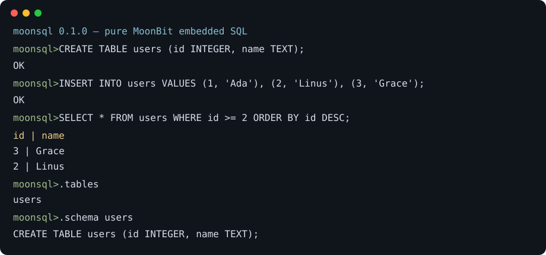

# moonsql

[](https://github.com/uiwcvb/moonsql/actions/workflows/ci.yml)
[](https://mooncakes.io/docs/uiwcvb/moonsql)
[](LICENSE)



`moonsql` 是一个纯 MoonBit、零 FFI 的嵌入式关系型 SQL 引擎。核心执行器与 B+Tree 可编译到 WebAssembly；当前 `0.1.0` 同时提供内存执行路径、4096B 页式单文件持久化和原生交互式 REPL。

> 状态说明：解析、类型检查、全语句执行、逻辑 B+Tree 和 `open/close` 二进制页恢复已实现。单文件由 4096B superblock、catalog/schema 页、B+Tree leaf/internal 页组成；每页带 32 位校验和，损坏文件在 `open` 时报 `storage_error` 而非静默坏数据。当前没有 WAL/事务，进程在 `close` 前崩溃可能丢失本次会话。原生 CLI 直接读取 stdin，支持 `--file/--version/--help`；`.tables/.schema/.ast/.version/.help/.quit` 复用可嵌入宿主的 `run_line` dispatcher。

## 快速上手

```bash
moon check
moon test
moon run src/main --target native -- my-database.mdb
```

库 API：

```moonbit
let db = @lib.open(":memory:")
let _ = db.execute("CREATE TABLE users (id INTEGER, name TEXT, score REAL)")
let _ = db.execute("INSERT INTO users VALUES (1, 'Ada', 9), (2, 'Bob', 7.5)")
let result = db.execute("SELECT name FROM users WHERE score >= 8 ORDER BY name LIMIT 10")
db.close()
```

`execute` 返回 `Result[QueryResult, SqlError]`；错误携带一基行号和列号。`Value` 是 `Integer(Int64) | Text(String) | Real(Double) | Null`，唯一隐式转换是 `INTEGER -> REAL`。

## 支持语法

| 功能 | 示例 |
|---|---|
| CREATE TABLE | `CREATE TABLE t (id INTEGER, name TEXT, score REAL)` |
| INSERT | `INSERT INTO t VALUES (1,'a',1.5), (2,'b',2)` |
| SELECT | `SELECT * FROM t` / `SELECT id,name FROM t` |
| UPDATE | `UPDATE t SET name='x' WHERE id=1` |
| DELETE | `DELETE FROM t WHERE id<>1` |
| DROP TABLE | `DROP TABLE t` |
| WHERE | `= <> < > <= >= AND OR NOT`，括号，AND 优先于 OR |
| 排序分页 | `ORDER BY score DESC LIMIT 10 OFFSET 20` |

## 架构


叶节点保存 `(rowid, row)`；内节点保存分隔键和子页。节点满 32 个逻辑项时分裂。`serialize` 以 `MOONSQL1` 魔数开始，pager 负责打包为 4096B 页。更完整的设计见 [docs/architecture.md](docs/architecture.md) 和 [docs/file-format.md](docs/file-format.md)。本实现没有复制或移植 SQLite 代码。

## REPL 点命令设计

`Connection::run_line` 支持 `.tables`、`.schema TABLE`、`.ast SQL`、`.version`、`.help`、`.quit` 与 `.exit`。`src/main` 使用 `moonbitlang/async/stdio` 提供真正的 native stdin REPL；`--file PATH` 指定数据库文件（默认 `moonsql.mdb`），`--version` 与 `--help` 打印信息后退出。

## Roadmap

- [x] 单文件二进制页：superblock/catalog/schema/leaf/internal page
- [ ] 原子临时文件替换与显式 fsync
- [x] Native stdin REPL 与 `.tables/.schema/.ast/.version/.help/.quit`
- [x] 页校验和（format v2）与崩溃/损坏恢复测试
- [x] CLI `--file/--version/--help`
- [ ] 事务/WAL（预留升级路径）
- [ ] JOIN、GROUP BY、子查询、CREATE INDEX、外键、并发

明确不在 MVP：JOIN、GROUP BY、子查询、事务、CREATE INDEX、外键和并发。

## 测试与发布

接近 200 个命名单元测试覆盖 lexer、parser、错误语法、全语句执行、格式校验与损坏恢复。发布前：

```bash
moon check --deny-warn
moon test
moon check --target wasm
moon package --list
moon publish
```

`moon publish` 需要 mooncakes.io 登录，因此 CI 不执行发布。公开仓库创建与徽章 URL 也应在仓库创建后确认。
